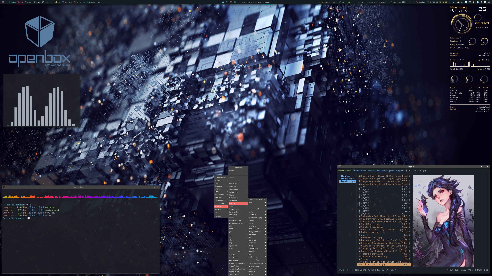
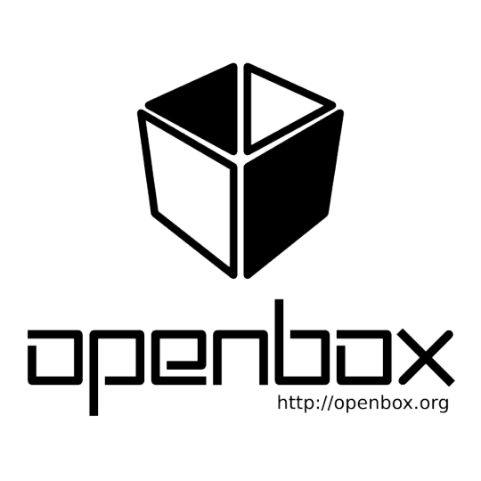

# openbox - highly configurable window manager

<br><br><br>

<div>


Openbox is a highly configurable window manager with extensive standards support.

The `*box` visual style is well known for its minimalistic appearance. Openbox uses the `*box` visual style, while providing a greater number of options for theme developers than previous `*box` implementations. The theme documentation describes the full range of options found in Openbox themes.

Openbox lets you bring the latest applications outside of a full desktop environment. Most modern applications have been written with GNOME and KDE in mind. With support for the latest freedesktop.org standards, as well as careful adherence to previous standards, Openbox provides an environment where applications work the way they were designed to.
</div>
<br>

# Intro
* Openbox allows you to change almost every aspect of how you interact with your desktop and invent completely new ways to use and control it. It can be like a video game for controlling windows. But Openbox can also be kept extremely simple, as it is in the default setup, meaning that it can suit just about anybody. Openbox gives you control without making you do everything.
* Openbox makes desktop environments better. By running Openbox inside the GNOME or K desktop environments, you can combine their ease and functionality with the power of Openbox. Your desktop becomes cleaner and faster, and is in your control, when you use Openbox.
* Take a look at the getting started guide and change how you manage your desktop. See open box main pages [openbox.org](http://openbox.org/wiki/Main_Page).
* **Openbox official documentation** is [here](http://openbox.org/wiki/Help:Contents).

# Project: openbox-config
This GitHub repository contains full configuration of openbox WM and additional features. The screenshot is present in the top of this article.

**List of used components**
+ **WM:** openbox-session with autostart and environment files
+ **Compositor:** picom
+ **Bar:** polybar [polybar-config](https://github.com/raven2cz/polybar-config)
+ **Conky:** [MX-CoreBlue](https://github.com/raven2cz/dotfiles/tree/main/.config/conky/MX-CoreBlue)
+ **Menu:** openbox static, generators and pipe-menus support, obfilebrowser
+ **Navigation:** rofi, [rofi-themes](https://github.com/raven2cz/rofi-themes)
+ **Wallpaper app:** nitrogen
+ **Sound service:** [volctl](https://github.com/buzz/volctl)
+ **Notfication service:** xfce4-notify
+ **Wallpaper:** [public-wallpapers](https://github.com/raven2cz/public-wallpapers) - [openbox wallpaper](https://github.com/raven2cz/public-wallpapers/blob/main/00046-openbox-1.jpg)

# Dependencies
* Install polybar and use this configuration project [polybar-config](https://github.com/raven2cz/polybar-config) to `.config`.
* Nerd-Fonts Iosevka, Open Sans, Source Code Pro.

Many optional dependencies according to your style. This is just example:
```bash
paru -S picom nitrogen tint2 polybar volctl clipmenu parcellite xfce4-notify
```

# Installation
Installation is described for Arch linux. Accordingly to this guide you can apply it for any other distribution.

Arch linux wiki for [openbox here](https://wiki.archlinux.org/title/Openbox).
```bash
paru -S openbox ttf-dejavu ttf-liberation obfilebrowser
```

# Guides and more Features
Visit our [forum](https://forum.arch-linux.cz/category/26/openbox). There are or will be more details and additional features for openbox WM.

# License
MIT License is included. Read [license file](LICENSE).
